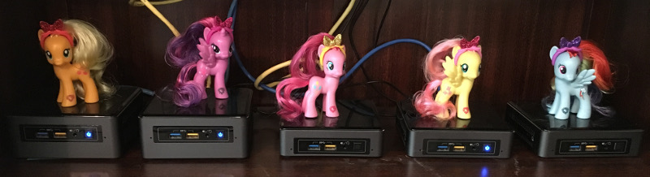

Rollersk8s helps you build out a local bare-metal Kubernetes cluster. Use it to pxe boot an unformatted machine, either creating a new cluster and making it the master,
or setting up a node and joining it to your existing cluster.

## OMG PONIES
Like any good child of the 80's, my character was forged in the fires of
My Little Ponies, Rainbow Brite, Teenage Mutant Ninja Turtles and the Care Bears.
When I bought a few Intel NUC kits to play with a bare-metal Kubernetes cluster and
naming them after ponies was more fun that node01-05.

* Princess Twilight Sparkle (master)
* Applejack
* Fluttershy
* Rainbow Dash
* Pinkie Pie

My "shorties" are Intel NUC7i5BNK kits with a 250GB nvme drive and 32GB of RAM.
While the "tall boys" are Intel NUC7i5BNH kits, which have an additional 500GB SSD.

## COMPONENTS

### dnsmasq
This needs to be hosted off of the cluster because it's used to bootstrap the machines
into a cluster. It uses [dnsmasq][dnsmasq] to handle a few related tasks:

* DHCP - When you PXE boot (boot from LAN) a machine, it will send a DHCP request
  and this will respond back with a static ip address, hostname and point to the URL
  where the OS installer is located.
* TFTP - A tiny FTP server which serves the PXE boot menus, operating system installer,
  configuration files and kubernetes setup scripts.
* DNS - When a machine requests an IP address via DHCP, the server remembers the hostname
  and answers DNS queries for that hostname with the assigned IP address. This is
  pretty useful for any home network. It also uses `/etc/hosts` to resolve names,
  so you can easily hardcode your node names, so that when they are PXE booted,
  they are automatically assigned the same hostname each time.

### kubeadm
After a machine is PXE booted, the finalization scripts use `kubeadm` to either create
a new cluster or join an existing cluster.

[dnsmasq]: https://wiki.debian.org/HowTo/dnsmasq
